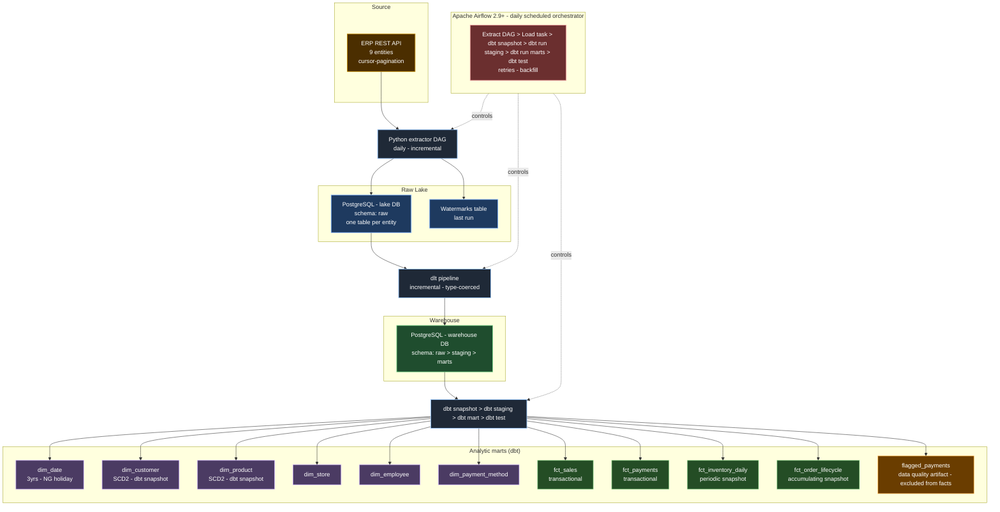

# RetailCo Stage 8 — Architecture Overview

## Purpose

This document explains the final architecture for RetailCo’s Stage 8 data platform. It is written to match the Checkpoint 1 architecture diagram while keeping the design practical, readable, and easy to defend during review.

The platform is organised as a layered pipeline so that extraction, storage, transformation, and orchestration each have a clear responsibility.

---

## Architecture Objective

The architecture is designed to:

- extract data incrementally from the ERP REST API
- land raw records safely in a lake database
- move raw data into the warehouse using dlt
- transform raw warehouse tables into Kimball marts using dbt
- run the full sequence through Airflow on a daily schedule
- support retries, backfill, and clean failure handling

---

## Layer 1 — Source

### ERP REST API
The source system is the RetailCo ERP REST API.

It provides the operational entities needed for the pipeline and supports:

- API-key authentication
- cursor pagination
- incremental extraction through `updated_after`

This layer remains read-only. No transformation happens here.

---

## Layer 2 — Extraction and Raw Lake

### Python Extractor
A handwritten Python extractor is responsible for pulling data from the ERP API.

Its main responsibilities are:

- authenticating requests
- following cursor-based pagination
- applying incremental filters
- retrying transient failures
- handling rate limits with backoff
- storing extraction watermarks
- writing raw rows into PostgreSQL

### Lake PostgreSQL
The first landing zone is the **lake PostgreSQL database**.

This layer stores:

- schema `raw`
- one raw table per source entity
- a watermark table that stores the last successful extraction point

The lake exists to preserve extracted source data before warehouse transformation begins.

---

## Layer 3 — Warehouse Load

### dlt Pipeline
The handoff from the lake to the warehouse is handled by `dlt`.

Its role is intentionally narrow:

- read from `lake.raw`
- write to `warehouse.raw`
- move only new or updated rows
- preserve types during transfer

### Warehouse PostgreSQL
The **warehouse PostgreSQL database** contains the transformation path:

- `raw`
- `staging`
- `marts`

This separation keeps ingestion concerns out of the transformation layer and makes the warehouse easier to troubleshoot.

---

## Layer 4 — Transformation and Analytic Marts

### dbt Transformation Flow
The warehouse transformation sequence follows this order:

1. `dbt snapshot`
2. `dbt run --select staging`
3. `dbt run --select marts`
4. `dbt test`

### Snapshots
`dbt snapshot` is used to preserve SCD Type 2 history for:

- `dim_customer`
- `dim_product`

### Staging
The staging layer standardises raw warehouse tables by:

- casting columns to the correct types
- renaming fields to snake_case
- preparing soft-delete handling
- separating anomalous payment logic for downstream modelling

### Marts
The final analytic marts contain:

#### Dimensions
- `dim_date`
- `dim_customer`
- `dim_product`
- `dim_store`
- `dim_employee`
- `dim_payment_method`

#### Facts
- `fct_sales` — transactional
- `fct_payments` — transactional
- `fct_inventory_daily` — periodic snapshot
- `fct_order_lifecycle` — accumulating snapshot

#### Data-quality artifact
- `flagged_payments` — isolated from normal fact analysis

---

## Layer 5 — Orchestration

### Apache Airflow 2.9+
Airflow acts as the orchestrator for the full daily pipeline.

The required execution order is:

1. Extract
2. Load
3. `dbt snapshot`
4. `dbt run --select staging`
5. `dbt run --select marts`
6. `dbt test`

Airflow also provides:

- retries
- backfill support
- dependency control
- task logging and run visibility

This ensures that downstream tasks do not run when an upstream step fails.

---

## End-to-End Flow

The complete data flow is:

`ERP REST API`
→ `Python Extractor`
→ `Lake PostgreSQL (raw + watermarks)`
→ `dlt Pipeline`
→ `Warehouse PostgreSQL (raw)`
→ `dbt snapshot`
→ `dbt staging`
→ `dbt marts`
→ `dbt test`
→ `Reporting and analytics`

---

## Operational Design Notes

### Incremental loading
The extractor uses `updated_after` together with stored watermarks so that daily runs process only new or changed records.

### Idempotent reruns
The pipeline is designed so that rerunning the same logical date does not create duplicate raw rows or inconsistent downstream outputs.

### Historical tracking
Customer and product changes are preserved through SCD Type 2 handling in dbt snapshots rather than overwritten in place.

### Data-quality handling
Zero-value and unexplained negative payments are isolated into `flagged_payments` so that they do not distort analytical facts.

### Observability
Airflow task logs and dbt test results provide visibility into pipeline health and model quality.

---

## Final Mermaid Diagram

---

## Summary

The final architecture keeps the platform easy to understand and easy to operate. The ERP API remains the source of truth, the lake preserves raw extracted data, dlt handles controlled raw-to-raw movement, dbt builds the warehouse, and Airflow keeps the process running in the correct order.

This structure is aligned with the Stage 8 brief and gives a clean foundation for the extractor, dlt pipeline, dbt project, and final Airflow DAG.
