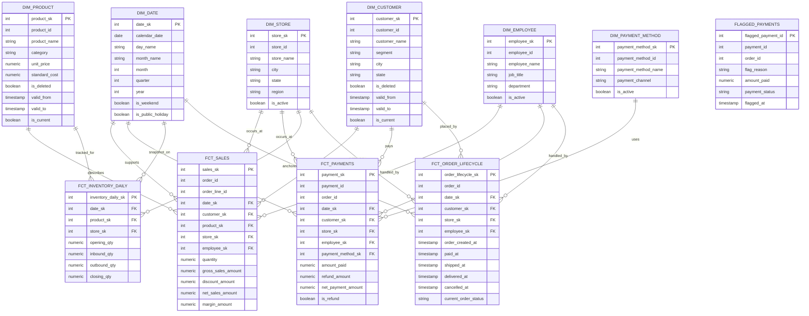

# RetailCo Stage 8 — Warehouse ERD

## Purpose

This document defines the logical warehouse ERD for RetailCo’s Stage 8 pipeline. It shows the core Kimball structures required for the warehouse: six conformed dimensions, four fact tables, and one supporting data-quality artifact. The design keeps each fact at a clear grain, uses surrogate keys for fact-to-dimension joins, and preserves historical change where the source system requires it.

The ERD is intentionally trimmed to the columns that matter most for design review. It is detailed enough to show warehouse logic, but not so overloaded that the model becomes difficult to read.

---

## Design Principles

- Every dimension uses a warehouse surrogate key.
- Facts join to dimensions through surrogate keys, not source-system natural keys.
- `dim_customer` and `dim_product` preserve history using SCD Type 2 columns.
- Each fact table represents one declared business process at one declared grain.
- `flagged_payments` is included as a warehouse-side data-quality artifact, but it is not part of the conformed Kimball fact model.

---

## Table Overview

### Dimensions
- `dim_date`
- `dim_customer` *(SCD Type 2)*
- `dim_product` *(SCD Type 2)*
- `dim_store`
- `dim_employee`
- `dim_payment_method`

### Facts
- `fct_sales`
- `fct_payments`
- `fct_inventory_daily`
- `fct_order_lifecycle`

### Supporting table
- `flagged_payments`

---

## Dimension Tables

### `dim_date`
**Purpose:** Shared calendar dimension used across all fact tables.

**Columns**
- `date_sk` *(PK)*
- `calendar_date`
- `day_name`
- `month_name`
- `month`
- `quarter`
- `year`
- `is_weekend`
- `is_public_holiday`

---

### `dim_customer` *(SCD Type 2)*
**Purpose:** Historical customer dimension preserving segment, address, and deletion-state changes over time.

**Columns**
- `customer_sk` *(PK)*
- `customer_id` *(natural key)*
- `customer_name`
- `segment`
- `city`
- `state`
- `is_deleted`
- `valid_from`
- `valid_to`
- `is_current`

---

### `dim_product` *(SCD Type 2)*
**Purpose:** Historical product dimension preserving category, price, and deletion-state changes over time.

**Columns**
- `product_sk` *(PK)*
- `product_id` *(natural key)*
- `product_name`
- `category`
- `unit_price`
- `standard_cost`
- `is_deleted`
- `valid_from`
- `valid_to`
- `is_current`

---

### `dim_store`
**Purpose:** Store lookup dimension for branch-level reporting.

**Columns**
- `store_sk` *(PK)*
- `store_id` *(natural key)*
- `store_name`
- `city`
- `state`
- `region`
- `is_active`

---

### `dim_employee`
**Purpose:** Employee lookup dimension for staff-associated sales, payment, and lifecycle processes.

**Columns**
- `employee_sk` *(PK)*
- `employee_id` *(natural key)*
- `employee_name`
- `job_title`
- `department`
- `is_active`

---

### `dim_payment_method`
**Purpose:** Payment method lookup for payment-channel reporting.

**Columns**
- `payment_method_sk` *(PK)*
- `payment_method_id` *(natural key)*
- `payment_method_name`
- `payment_channel`
- `is_active`

---

## Fact Tables

### `fct_sales`
**Business process:** Sales transactions  
**Grain:** One row per order line

**Columns**
- `sales_sk` *(PK)*
- `order_id`
- `order_line_id`
- `date_sk` *(FK → dim_date)*
- `customer_sk` *(FK → dim_customer)*
- `product_sk` *(FK → dim_product)*
- `store_sk` *(FK → dim_store)*
- `employee_sk` *(FK → dim_employee)*
- `quantity`
- `gross_sales_amount`
- `discount_amount`
- `net_sales_amount`
- `margin_amount`

---

### `fct_payments`
**Business process:** Payment events  
**Grain:** One row per payment event

**Columns**
- `payment_sk` *(PK)*
- `payment_id`
- `order_id`
- `date_sk` *(FK → dim_date)*
- `customer_sk` *(FK → dim_customer)*
- `store_sk` *(FK → dim_store)*
- `employee_sk` *(FK → dim_employee)*
- `payment_method_sk` *(FK → dim_payment_method)*
- `amount_paid`
- `refund_amount`
- `net_payment_amount`
- `is_refund`

---

### `fct_inventory_daily`
**Business process:** Inventory snapshots  
**Grain:** One row per product per store per day

**Columns**
- `inventory_daily_sk` *(PK)*
- `date_sk` *(FK → dim_date)*
- `product_sk` *(FK → dim_product)*
- `store_sk` *(FK → dim_store)*
- `opening_qty`
- `inbound_qty`
- `outbound_qty`
- `closing_qty`

---

### `fct_order_lifecycle`
**Business process:** Order fulfilment lifecycle  
**Grain:** One row per order

**Columns**
- `order_lifecycle_sk` *(PK)*
- `order_id`
- `date_sk` *(FK → dim_date)*
- `customer_sk` *(FK → dim_customer)*
- `store_sk` *(FK → dim_store)*
- `employee_sk` *(FK → dim_employee)*
- `order_created_at`
- `paid_at`
- `shipped_at`
- `delivered_at`
- `cancelled_at`
- `current_order_status`

---

## Supporting Data-Quality Table

### `flagged_payments`
**Purpose:** Isolates anomalous payment rows such as zero-value or unexplained negative payments so they do not contaminate analytical payment and revenue models.

**Columns**
- `flagged_payment_id` *(PK)*
- `payment_id`
- `order_id`
- `flag_reason`
- `amount_paid`
- `payment_status`
- `flagged_at`

**Design note:** This table supports operational data-quality monitoring and investigation. It is not part of the conformed Kimball bus matrix.

---

## Relationship Summary

### `dim_date`
Used by:
- `fct_sales`
- `fct_payments`
- `fct_inventory_daily`
- `fct_order_lifecycle`

### `dim_customer`
Used by:
- `fct_sales`
- `fct_payments`
- `fct_order_lifecycle`

### `dim_product`
Used by:
- `fct_sales`
- `fct_inventory_daily`

### `dim_store`
Used by:
- `fct_sales`
- `fct_payments`
- `fct_inventory_daily`
- `fct_order_lifecycle`

### `dim_employee`
Used by:
- `fct_sales`
- `fct_payments`
- `fct_order_lifecycle`

### `dim_payment_method`
Used by:
- `fct_payments`

---

## SCD Type 2 Handling

`dim_customer` and `dim_product` are modelled as Slowly Changing Dimensions Type 2. Each table stores both the natural key from the source system and the warehouse surrogate key used by facts. Historical tracking is handled through:

- `valid_from`
- `valid_to`
- `is_current`

This ensures that historical facts resolve to the correct customer or product version at the time of the event rather than being overwritten by the latest source state.

---

## ERD Narrative

The warehouse ERD is built around four separate business processes: sales, payments, inventory snapshots, and order lifecycle progression. Each fact table is anchored to a single grain, which prevents line-level activity, payment events, inventory state, and order milestones from being mixed into the same structure.

The design uses conformed dimensions so that shared business questions can be answered consistently across marts. Store, customer, employee, and date recur across multiple processes, while product is only attached where the fact grain naturally supports it. This is why product appears in `fct_sales` and `fct_inventory_daily` but not in `fct_order_lifecycle`.

The ERD also makes historical change explicit. Customer and product attributes can change over time, so both dimensions are designed as SCD Type 2 tables. This protects historical reporting from being rewritten when a customer changes segment or a product changes category or price.

---

## Mermaid ERD

---

## Summary

This ERD gives RetailCo a clean warehouse foundation for Checkpoint 1. It keeps the business processes separate, preserves historical customer and product change, and ensures that later dbt models can be built on stable dimensional rules rather than ad hoc joins.
